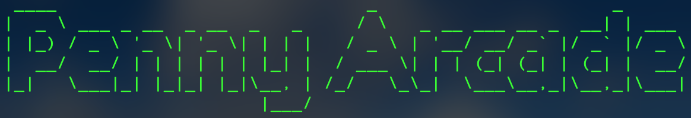

<!-- PROJECT LOGO -->
<div align="center">
  <a href="https://github.com/EoghyUnscripted/Arcade-Games-Core">
    
  </a>

[![Contributors][contributors-shield]][contributors-url]
[![Forks][forks-shield]][forks-url]
[![Stargazers][stars-shield]][stars-url]
[![Issues][issues-shield]][issues-url]
[![MIT License][license-shield]][license-url]

  <p align="center">
    Designed and built for the nostalgia, the "Penny Arcade" is a core Python application that lets users play solo games like Blackjack or Hangman in a terminal or console window.
    <br />
    <a href="https://github.com/EoghyUnscripted/Arcade-Games-Core"><strong>Explore the docs »</strong></a>
    <br />
    <br />
    <a href="https://replit.com/@EoghyUnscripted/Penny-Arcade">View Demo</a>
    ·
    <a href="https://github.com/EoghyUnscripted/Arcade-Games-Core/issues">Report Bug</a>
    ·
    <a href="https://github.com/EoghyUnscripted/Arcade-Games-Core/issues">Request Feature</a>
  </p>
</div>

<!-- TABLE OF CONTENTS -->
<details>
  <summary>Table of Contents</summary>
  <ol>
    <li>
      <a href="#about-the-project">About The Project</a>
      <ul>
        <li><a href="#developed-using">Developed Using</a></li>
      </ul>
    </li>
    <li>
      <a href="#getting-started">Getting Started</a>
      <ul>
        <li><a href="#prerequisites">Prerequisites</a></li>
        <li><a href="#installation">Installation</a></li>
        <ul>
            <li><a href="#python-for-windows-os">Install Python for Windows OS</a></li>
            <li><a href="#python-for-macos">Install Python for MacOS</a></li>
            <li><a href="#requests">Install Requests</a></li>
        </ul>
      </ul>
    </li>
    <li><a href="#goals">Goals</a></li>
    <li><a href="#contributing">Contributing</a></li>
    <li><a href="#license">License</a></li>
    <li><a href="#contact">Contact</a></li>
    <li><a href="#acknowledgments">Acknowledgments</a></li>
  </ol>
</details>

<!-- ABOUT THE PROJECT -->
## About The Project

[![Product Name Screen Shot][product-screenshot]](https://replit.com/@EoghyUnscripted/Penny-Arcade)

### Developed Using

[![Python][Python]][Python-URL]
[![Visual Studio Code][Visual-Studio-Code]][Visual-Studio-Code-URL]

<!-- GETTING STARTED -->
## Getting Started

To ensure success in running the application, please follow the steps below prior to attempting to run the application in the terminal, console, or IDE of your choice.

### Prerequisites

- [Python 3](https://python.org/)
- [Requests](https://pypi.org/project/requests/) - Python HTTP for Humans used in the consumption of APIs

### Installation

#### Install Python for Windows OS

- Download the [Python 3 Windows embeddable package](https://www.python.org/downloads/) and follow the setup guide to install

#### Install Python for MacOS

MacOS comes pre-installed with Python. You can check for the installed Python version(s) in the terminal by entering the command in a terminal window.

```sh
% python --version
Python 3.11.5
```

To update to the newest version:

```sh
% python --version
Python 3.11.5
```

#### Install Requests

Both Windows and Mac users should be able to install the requests library directly from a terminal or console window once Python has been installed on the device or environment.

```sh
pip install requests
```

Alternatively, you can install using the `requirements.txt` file.

```sh
pip install -r requirements.txt
```

<!-- GOALS -->
## Goals

- [ ] Remove duplicate code and create functions in place
- [ ] Improve error handling

<!-- CONTRIBUTING -->
## Contributing

While this app was developed simply for fun, please feel free to contribute new ideas and enhancements to this project.

1. Fork the Project
2. Create your Feature Branch (`git checkout -b feature/AmazingFeature`)
3. Commit your Changes (`git commit -m 'Add some AmazingFeature'`)
4. Push to the Branch (`git push origin feature/AmazingFeature`)
5. Open a Pull Request

<!-- LICENSE -->
## License

Distributed under the MIT License. See `LICENSE.txt` for more information.

<!-- CONTACT -->
## Contact

Eoghan - [@EoghyUnscripted](https://twitter.com/EoghyUnscripted)

Project Link: [https://github.com/EoghyUnscripted/Arcade-Games-Core](https://github.com/EoghyUnscripted/Arcade-Games-Core)

<!-- ACKNOWLEDGMENTS -->
## Acknowledgments

- Bullwinkle - Is tú grá mo chroí agus mo chúis
- [Best-README-Template](https://github.com/othneildrew/Best-README-Template) - Template used for this README

<!-- MARKDOWN LINKS & IMAGES -->
<!-- https://www.markdownguide.org/basic-syntax/#reference-style-links -->
[contributors-shield]: https://img.shields.io/github/contributors/EoghyUnscripted/Arcade-Games-Core.svg?style=for-the-badge
[contributors-url]: https://github.com/EoghyUnscripted/Arcade-Games-Core/graphs/contributors
[forks-shield]: https://img.shields.io/github/forks/EoghyUnscripted/Arcade-Games-Core.svg?style=for-the-badge
[forks-url]: https://github.com/EoghyUnscripted/Arcade-Games-Core/network/members
[stars-shield]: https://img.shields.io/github/stars/EoghyUnscripted/Arcade-Games-Core.svg?style=for-the-badge
[stars-url]: https://github.com/EoghyUnscripted/Arcade-Games-Core/stargazers
[issues-shield]: https://img.shields.io/github/issues/EoghyUnscripted/Arcade-Games-Core.svg?style=for-the-badge
[issues-url]: https://github.com/EoghyUnscripted/Arcade-Games-Core/issues
[license-shield]: https://img.shields.io/github/license/EoghyUnscripted/Arcade-Games-Core.svg?style=for-the-badge
[license-url]: https://github.com/EoghyUnscripted/Arcade-Games-Core/blob/master/LICENSE.txt
[product-screenshot]: Images/penny_arcade.png
[Python]: https://img.shields.io/badge/python-3670A0?style=for-the-badge&logo=python&logoColor=ffdd54
[Python-URL]: https://python.org/
[Visual-Studio-Code]: https://img.shields.io/badge/Visual%20Studio%20Code-0078d7.svg?style=for-the-badge&logo=visual-studio-code&logoColor=white
[Visual-Studio-Code-URL]: https://code.visualstudio.com/
